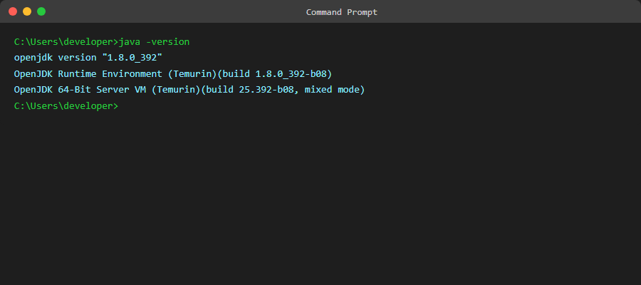
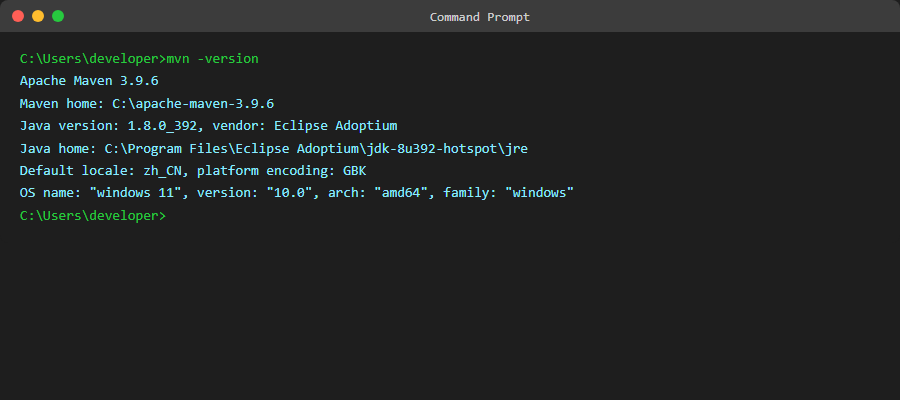

# 第一节：开发环境搭建（上）- JDK 与 Maven 安装

> **学习目标**：完成 Java 开发环境的搭建，为后续 Spring Boot 项目开发做好准备

---

## 1.1 本节概述

在开始编写代码之前，我们需要先搭建好开发环境。本节将带你完成以下内容的安装和配置：

- JDK（Java Development Kit）安装与配置
- Maven 构建工具安装与配置
- 验证环境是否搭建成功

**预计学习时间**：30 分钟

---

## 1.2 JDK 安装与配置

### 1.2.1 什么是 JDK？

JDK（Java Development Kit）是 Java 开发工具包，包含了：
- **JRE**（Java Runtime Environment）：Java 运行时环境
- **开发工具**：编译器（javac）、调试器等

mall-tiny 项目基于 **Spring Boot 2.7.x**，需要 **JDK 1.8 或更高版本**。本教程使用 **JDK 1.8**（也称为 Java 8），这是目前企业开发中最常用的版本。

### 1.2.2 下载 JDK

**官方下载地址**：https://www.oracle.com/java/technologies/downloads/

或者使用开源版本 **OpenJDK**：https://adoptium.net/

**Windows 用户**：
1. 访问 https://adoptium.net/
2. 选择 **OpenJDK 8 (LTS)**
3. 操作系统选择 **Windows**
4. 架构选择 **x64**
5. 下载 `.msi` 安装包

> 💡 **提示**：Adoptium 提供的 OpenJDK 是免费的，无需 Oracle 账号即可下载。

### 1.2.3 安装 JDK

**Windows 安装步骤**：

1. 双击下载的 `.msi` 文件
2. 按照向导提示完成安装
3. **建议安装路径**：`C:\Program Files\Eclipse Adoptium\jdk-8uXXX-hotspot`


*图1-1：JDK安装向导界面*

安装完成后，我们需要配置环境变量。

> 💡 **常见问题**：安装过程中提示"已安装其他版本"
> - 解决方案：先卸载旧版本 JDK，或在环境变量中优先使用新版本

### 1.2.4 配置环境变量

**Windows 配置步骤**：

1. **打开环境变量设置**：
   - 右键点击"此电脑" → 属性 → 高级系统设置 → 环境变量


*图1-2：系统环境变量配置界面*

2. **新建 JAVA_HOME 变量**：
   - 变量名：`JAVA_HOME`
   - 变量值：`C:\Program Files\Eclipse Adoptium\jdk-8uXXX-hotspot`（根据实际安装路径调整）


*图1-3：新建 JAVA_HOME 环境变量*

3. **编辑 Path 变量**：
   - 在 Path 变量中添加：`%JAVA_HOME%\bin`


*图1-4：在 Path 中添加 Java 路径*

4. **验证安装**：
   打开命令提示符（CMD），输入：
   ```bash
   java -version
   ```
   
   如果显示类似以下内容，说明安装成功：
   ```
   openjdk version "1.8.0_392"
   OpenJDK Runtime Environment (Temurin)(build 1.8.0_392-b08)
   OpenJDK 64-Bit Server VM (Temurin)(build 25.392-b08, mixed mode)
   ```


*图1-5：命令行验证 JDK 安装*

> ⚠️ **常见问题**：`java -version` 提示"不是内部或外部命令"
> - 检查环境变量是否保存成功
> - 重新打开 CMD 窗口（环境变量修改后需要新开窗口）
> - 检查 Path 变量中 `%JAVA_HOME%\bin` 是否正确

---

## 1.3 Maven 安装与配置

### 1.3.1 什么是 Maven？

Maven 是 Java 项目的构建工具，主要功能：
- **依赖管理**：自动下载项目所需的 jar 包
- **项目构建**：编译、测试、打包、部署
- **项目结构标准化**：统一的目录结构

mall-tiny 使用 Maven 作为构建工具，我们需要先安装它。

### 1.3.2 下载 Maven

**官方下载地址**：https://maven.apache.org/download.cgi

1. 访问下载页面
2. 下载 **Binary zip archive**（如 `apache-maven-3.9.x-bin.zip`）

### 1.3.3 安装 Maven

**Windows 安装步骤**：

1. 解压下载的 zip 文件到指定目录
2. **建议路径**：`C:\apache-maven-3.9.x`

### 1.3.4 配置环境变量

1. **新建 MAVEN_HOME 变量**：
   - 变量名：`MAVEN_HOME`
   - 变量值：`C:\apache-maven-3.9.x`

2. **编辑 Path 变量**：
   - 在 Path 变量中添加：`%MAVEN_HOME%\bin`

3. **验证安装**：
   打开命令提示符，输入：
   ```bash
   mvn -version
   ```
   
   如果显示类似以下内容，说明安装成功：
   ```
   Apache Maven 3.9.x
   Maven home: C:\apache-maven-3.9.x
   Java version: 1.8.0_392, vendor: Eclipse Adoptium
   Java home: C:\Program Files\Eclipse Adoptium\jdk-8u392-hotspot\jre
   Default locale: zh_CN, platform encoding: GBK
   OS name: "windows 11", version: "10.0", arch: "amd64", family: "windows"
   ```


*图1-6：命令行验证 Maven 安装*

> ⚠️ **常见问题**：`mvn -version` 提示找不到命令
> - 检查 MAVEN_HOME 和 Path 配置是否正确
> - 确保路径中没有中文或特殊字符
> - 重新打开 CMD 窗口

### 1.3.5 配置本地仓库（可选）

Maven 默认将下载的依赖存放在 `C:\Users\你的用户名\.m2\repository`。

如果你想修改本地仓库位置，可以编辑 `conf\settings.xml`：

```xml
<settings>
  <localRepository>D:/maven-repo</localRepository>
</settings>
```

> 💡 **建议**：如果 C 盘空间有限，可以将仓库移到其他盘。

### 1.3.6 配置阿里云镜像（推荐）

Maven 默认从中央仓库下载依赖，速度较慢。建议配置阿里云镜像：

编辑 `conf\settings.xml`，在 `<mirrors>` 标签内添加：

```xml
<mirror>
  <id>aliyunmaven</id>
  <name>阿里云公共仓库</name>
  <url>https://maven.aliyun.com/repository/public</url>
  <mirrorOf>central</mirrorOf>
</mirror>
```


*图1-7：settings.xml 中配置阿里云镜像*

这样可以大幅提升依赖下载速度。

> 💡 **验证镜像配置**：
> ```bash
> mvn help:effective-settings
> ```
> 查看输出的 mirrors 部分，确认阿里云镜像已生效

---

## 1.4 常见问题汇总

| 问题 | 原因 | 解决方案 |
|-----|------|---------|
| `java -version` 找不到命令 | 环境变量未生效 | 重新打开 CMD 窗口，检查 Path 配置 |
| JDK 安装后版本不对 | 多个 JDK 版本冲突 | 卸载旧版本，或调整环境变量顺序 |
| Maven 下载依赖很慢 | 使用国外中央仓库 | 配置阿里云镜像 |
| Maven 提示内存不足 | 默认内存设置太小 | 设置 MAVEN_OPTS：`-Xmx512m` |
| 中文路径导致报错 | Maven 不支持中文路径 | 将 Maven 安装到英文路径 |

## 1.5 本节小结

完成本节学习后，你应该已经：

✅ 安装了 JDK 1.8 并配置了环境变量  
✅ 安装了 Maven 并配置了环境变量  
✅ 配置了阿里云镜像加速依赖下载  

**验证命令**：
```bash
java -version
mvn -version
```

两个命令都能正常输出版本信息，说明环境搭建成功。

**环境配置检查清单**：
- [ ] JDK 安装完成
- [ ] JAVA_HOME 环境变量配置正确
- [ ] Path 中包含 `%JAVA_HOME%\bin`
- [ ] Maven 安装完成
- [ ] MAVEN_HOME 环境变量配置正确
- [ ] Path 中包含 `%MAVEN_HOME%\bin`
- [ ] settings.xml 中配置了阿里云镜像

---

## 1.6 下节预告

**第二节：开发环境搭建（下）- IDEA 安装与配置**

我们将安装 IntelliJ IDEA Community 版本，并进行必要的配置，包括：
- IDEA 下载与安装
- 常用插件推荐
- Maven 配置
- 编码格式设置

---

## 参考资源

- [JDK 官方文档](https://docs.oracle.com/javase/8/docs/)
- [Maven 官方文档](https://maven.apache.org/guides/)
- [阿里云 Maven 仓库指南](https://developer.aliyun.com/mvn/guide)
