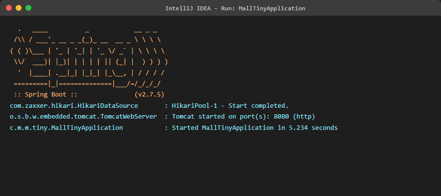
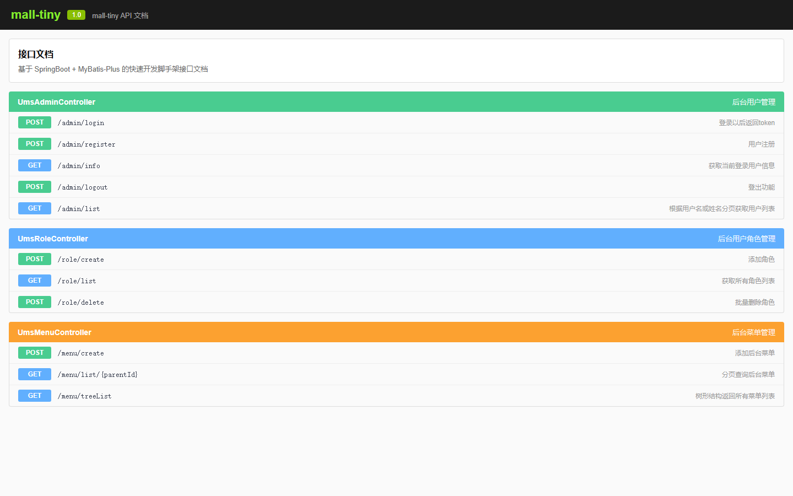
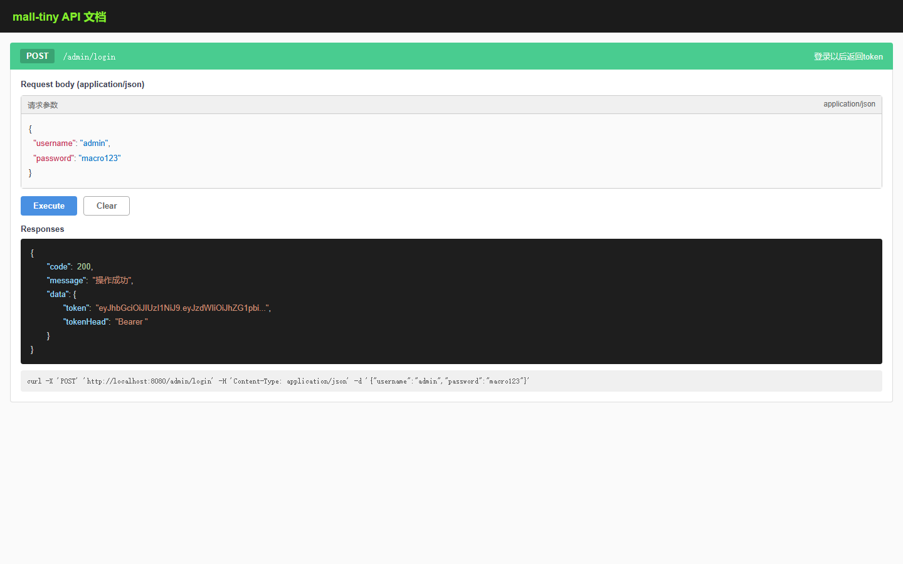

# 第五节：mall-tiny 后端项目启动

> **学习目标**：导入 mall-tiny 项目，理解项目结构，成功启动后端服务

---

## 5.1 本节概述

本节将带你完成：
- 将 mall-tiny 导入 IDEA
- 理解项目结构和模块划分
- 配置数据库和 Redis 连接
- 启动项目并验证

**预计学习时间**：30 分钟

---

## 5.2 导入项目

### 5.2.1 打开项目

1. 打开 IDEA
2. 点击 **Open**（不要选 New Project）
3. 选择 `mall-tiny` 文件夹
4. 等待 Maven 自动导入依赖（首次加载可能需要几分钟）

### 5.2.2 确认 Maven 导入

如果右下角弹出 Maven 导入提示，点击 **Enable Auto-Import**。

---

## 5.3 项目结构解析

```
mall-tiny/
├── src/main/java/com/macro/mall/tiny/
│   ├── common/          # 通用代码
│   │   ├── api/         # 统一返回结果封装
│   │   ├── config/      # 通用配置
│   │   ├── exception/   # 全局异常处理
│   │   └── service/     # 通用业务
│   ├── config/          # SpringBoot 配置
│   ├── generator/       # 代码生成器
│   ├── modules/         # 业务模块
│   │   └── ums/         # 权限管理模块
│   │       ├── controller/  # 控制器
│   │       ├── dto/         # 数据传输对象
│   │       ├── mapper/      # 数据访问层
│   │       ├── model/       # 实体类
│   │       └── service/     # 业务层
│   └── security/        # SpringSecurity 配置
├── src/main/resources/
│   ├── mapper/          # MyBatis XML 文件
│   ├── application.yml  # 主配置文件
│   ├── application-dev.yml  # 开发环境配置
│   └── application-prod.yml # 生产环境配置
└── pom.xml              # Maven 配置
```


*图5-1：mall-tiny 项目结构概览*

### 5.3.1 分层架构说明

mall-tiny 采用经典的分层架构：

```
┌─────────────────────────────────────────┐
│           Controller 层                  │
│    (接收请求、参数校验、调用 Service)      │
├─────────────────────────────────────────┤
│           Service 层                     │
│    (业务逻辑、事务管理、调用 Mapper)       │
├─────────────────────────────────────────┤
│           Mapper 层                      │
│    (数据访问、SQL 执行)                   │
├─────────────────────────────────────────┤
│           Model 层                       │
│    (实体类、与数据库表对应)                │
└─────────────────────────────────────────┘
```

---

## 5.4 配置文件修改

### 5.4.1 修改数据库配置

打开 `application-dev.yml`：

```yaml
spring:
  datasource:
    url: jdbc:mysql://localhost:3306/mall_tiny?useUnicode=true&characterEncoding=utf-8&serverTimezone=Asia/Shanghai
    username: root        # 修改为你的用户名
    password: root        # 修改为你的密码
```


*图5-2：application-dev.yml 数据库配置*

**配置项说明**：
| 配置项 | 说明 | 示例值 |
|-------|------|--------|
| url | 数据库连接地址 | jdbc:mysql://localhost:3306/mall_tiny |
| username | 数据库用户名 | root |
| password | 数据库密码 | 你的密码 |
| useUnicode | 使用 Unicode 编码 | true |
| characterEncoding | 字符编码 | utf-8 |
| serverTimezone | 服务器时区 | Asia/Shanghai |

### 5.4.2 修改 Redis 配置

```yaml
spring:
  redis:
    host: localhost
    port: 6379
    database: 0
```

---

## 5.5 启动项目

### 5.5.1 找到启动类

启动类路径：`src/main/java/com/macro/mall/tiny/MallTinyApplication.java`

### 5.5.2 运行项目

1. 打开 `MallTinyApplication.java`
2. 点击类名左侧的绿色箭头
3. 选择 **Run 'MallTinyApplication'**

### 5.5.3 验证启动

控制台输出以下日志说明启动成功：
```
Started MallTinyApplication in x.xxx seconds
Tomcat started on port(s): 8080
```


*图5-3：IDEA 控制台显示项目启动成功*

**关键启动日志解读**：
```
# Spring Boot 版本信息
:: Spring Boot ::               (v2.7.5)

# 数据源初始化
o.a.c.c.C.[Tomcat].[localhost].[/]       : Initializing Spring embedded WebApplicationContext
com.zaxxer.hikari.HikariDataSource       : HikariPool-1 - Starting...
com.zaxxer.hikari.HikariDataSource       : HikariPool-1 - Start completed

# 启动完成
c.m.m.tiny.MallTinyApplication           : Started MallTinyApplication in 5.234 seconds
```

---

## 5.6 测试接口

### 5.6.1 访问 Swagger 文档

打开浏览器访问：http://localhost:8080/swagger-ui/


*图5-4：Swagger API 文档界面*

### 5.6.2 测试登录接口

1. 找到 `UmsAdminController` 的 `/admin/login` 接口
2. 点击 **Try it out**


*图5-5：Swagger 中测试登录接口*

3. 输入参数：
   ```json
   {
     "username": "admin",
     "password": "macro123"
   }
   ```
4. 点击 **Execute**

**预期响应**：
```json
{
  "code": 200,
  "message": "操作成功",
  "data": {
    "token": "eyJhbGciOiJIUzI1NiJ9.eyJzdWIiOiJhZG1pbiIs...",
    "tokenHead": "Bearer "
  }
}
```

如果返回 token，说明后端服务正常运行！

---

## 5.7 常见问题与解决方案

| 问题 | 现象 | 解决方案 |
|-----|------|---------|
| 端口被占用 | `Port 8080 was already in use` | 修改 `application.yml` 中的 `server.port: 8081` |
| 数据库连接失败 | `Communications link failure` | 检查 MySQL 是否启动；检查用户名密码；检查数据库是否存在 |
| Redis 连接失败 | `Connection refused: connect` | 检查 Redis 是否启动；检查 `application.yml` 中 Redis 配置 |
| 依赖下载慢 | 构建时长时间卡顿 | 确认 Maven 配置了阿里云镜像；检查网络连接 |
| 时区错误 | `The server time zone value` | 在 JDBC URL 中添加 `serverTimezone=Asia/Shanghai` |
| 编码问题 | 中文乱码 | 确认数据库使用 utf8mb4；IDEA 设置 UTF-8 编码 |

### 5.7.1 端口被占用解决方案

```yaml
# application.yml
server:
  port: 8081  # 修改为其他端口
```

### 5.7.2 数据库连接问题排查

```bash
# 1. 检查 MySQL 是否运行
netstat -ano | findstr :3306

# 2. 测试连接
mysql -u root -p -e "SELECT 1"

# 3. 检查数据库是否存在
mysql -u root -p -e "SHOW DATABASES LIKE 'mall_tiny'"
```

---

## 5.8 本节小结

✅ 成功导入 mall-tiny 项目  
✅ 理解了项目结构和模块划分  
✅ 配置了数据库和 Redis 连接  
✅ 成功启动后端服务并通过 Swagger 测试

---

## 5.9 下节预告

**第六节：前端项目部署**

我们将部署 mall-admin-web 前端项目，实现前后端联调。

---

## 参考资源

- [mall-tiny 项目文档](https://www.macrozheng.com)
- [Spring Boot 官方文档](https://spring.io/projects/spring-boot)
